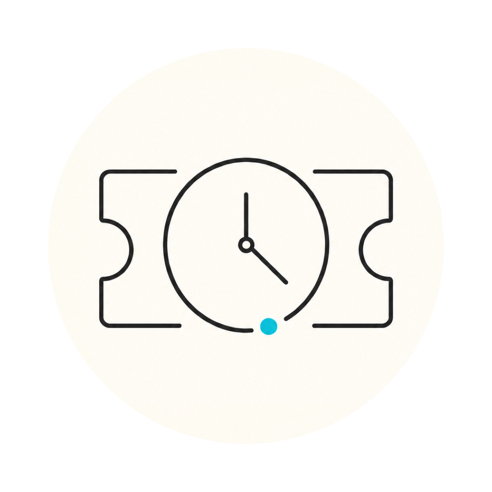

<p align="center">
  
</p>

<h1 align="center">Tixcraft Time</h1>

<p align="center">
  一個輕量的 macOS 拓元網域時間工具，讓同步時鐘與倒數計時常駐在畫面上。<br>
  A lightweight macOS utility that keeps an estimated Tixcraft domain clock and countdown visible beside your browser.
</p>

<p align="center">
  macOS 12+ &nbsp;|&nbsp; Swift + AppKit &nbsp;|&nbsp; arm64 + x86_64 &nbsp;|&nbsp; MIT
</p>

> [!IMPORTANT]
> This is an unofficial utility and is not affiliated with or endorsed by Tixcraft. It displays an estimate derived from response headers; it is not the official ticket-sale decision clock.

## Highlights

| Focus | What it provides |
| --- | --- |
| Domain clock | `HH:mm:ss.SS` display using `X-Timer`, with HTTP `Date` as fallback |
| Floating workflow | Always on top, all Spaces, edge snapping, resizing, position saving, locking, and click-through |
| Compact view | A time-only layout whose controls appear when the pointer enters the clock |
| Countdown | Switch between the live clock and a countdown to a configurable target |
| Native controls | Dock presence, standard app menus, menu bar item, right-click menu, and Settings window |
| Fast access | Global `Command + Option + T` shortcut to show or hide the clock |
| Resource control | Display and synchronization timers pause while hidden and stop completely on Quit |
| Native security | App Sandbox, Hardened Runtime, fixed HTTPS host validation, and no third-party runtime packages |

## Quick Start

Requirements:

- macOS 12 or later
- Xcode Command Line Tools with `swiftc` and `lipo`

Build and launch from source:

```zsh
git clone https://github.com/stephenlin999/tixcraft_floating_clock.git
cd tixcraft_floating_clock
./run.sh
```

Or build without launching:

```zsh
./build_app.sh
open TixcraftTime.app
```

The default output is an ad-hoc signed Universal Binary for local use. Build with a Developer ID identity when preparing a public release:

```zsh
SIGN_IDENTITY="Developer ID Application: Your Name (TEAMID)" ./build_app.sh
```

A Developer ID build must still be submitted to Apple Notarization before public distribution outside the Mac App Store.

## Controls

| Action | Control |
| --- | --- |
| Show or hide from any app | `Command + Option + T` |
| Move | Drag an unused area of the floating clock |
| Resize | Drag a window edge; the clock keeps its aspect ratio |
| Open clock controls | Right-click the floating clock or use the menu bar item |
| Switch clock/countdown | Settings, menu bar, or the clock's right-click menu |
| Recover from click-through | Use the menu bar item, Dock/main menu, or global shortcut |
| Restore an off-screen clock | Select **Move to Current Screen** |
| Exit completely | Press `X` on the clock or choose **Quit Tixcraft Time** |

Choosing **Hide Clock** keeps the menu bar item available while pausing display and scheduled synchronization work. Pressing `X` or choosing **Quit** invalidates timers, cancels network work, and terminates the process.

## How Synchronization Works

Tixcraft Time sends a `HEAD` request to `https://tixcraft.com/activity`, validates the final HTTPS host, and reads the response time headers. It prefers the fractional `X-Timer` value and falls back to HTTP `Date` when needed.

The app estimates the observation point using the network round-trip midpoint, then advances the accepted timestamp using macOS monotonic uptime. Recent RTT, jitter, TTFB, and VBE values remain visible in the detailed clock view. It resynchronizes on the selected 15, 30, or 60 second interval and after the Mac wakes.

`X-Timer` normally describes CDN or edge timing, while HTTP `Date` has whole-second precision. Network asymmetry, caching, and upstream behavior can all affect the estimate. Extra decimal places should not be interpreted as guaranteed accuracy.

## Privacy and Security

The app has no account system, analytics, payment access, embedded browser, or ticket-purchase automation. Its sandbox only requests outbound network access. Requests start at the fixed Tixcraft HTTPS endpoint, and redirects away from `https://tixcraft.com` are rejected.

See [Security Guidelines](SECURITY_GUIDELINES.md) for the threat model and proposed requirements. The [Security Review Guide](SECURITY_REVIEW_GUIDE.md) preserves the dated 2026-09-05 baseline and adversarial verification matrix.

## Project Layout

```text
TixcraftFloatingTime.swift   AppKit application and self-tests
build_app.sh                 Universal build, bundle, validation, and signing
run.sh                       Build and launch helper
TixcraftTime.entitlements    Sandbox permissions
assets/                      App icon and repository artwork
```

## Roadmap

- Developer ID signing and Apple Notarization in CI
- Runtime smoke tests on macOS 12 and macOS 13
- Optional countdown notifications without purchase automation
- Additional time-source profiles after the single-source trust model is stable

## License

Released under the [MIT License](LICENSE).
