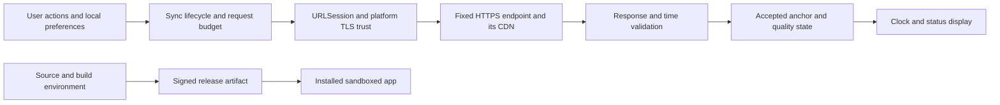

# Tixcraft Time Security Guidelines — Proposed Design

Date: 2026-09-05 (Asia/Taipei). Status: planning only; no application, build, entitlement, or deployment changes are authorized by this document. These are proposed acceptance requirements, not claims about implemented protections. The companion [Security Review Guide](SECURITY_REVIEW_GUIDE.md) records the inspected baseline, evidence, and future verification procedure.

## 1. Security objective and actual scope

The product is a native macOS Swift/AppKit clock. It sends HEAD requests to `https://tixcraft.com/activity`, parses `X-Timer` or HTTP `Date`, anchors an estimated time to local uptime, and displays it in a floating window. The inspected application has no backend service, account system, database, payment flow, embedded browser, updater, or listening network service. Its local preferences contain display options and window positions. The separate Node/Chrome header probe is developer tooling and is not copied into the application by the inspected build script.

The primary security objective is to prevent an untrustworthy time estimate from being presented as reliable. Protect the executable's authenticity, the user's machine and privacy, and the availability of both the app and the external service. A maliciously incorrect clock can affect a user's timing decisions even without stealing credentials or executing code.

The product must describe its output as an estimate of the observed endpoint or edge time. A precise display is not evidence of precise synchronization. The app cannot establish the ticketing system's sale-opening or purchase-authorization clock from these headers. TLS also does not establish that a timestamp supplied by an authenticated endpoint is accurate.

This design does not add a server, login system, WAF, custom cryptography, or a second time provider to the current product. If such features are proposed later, the review scope must change before implementation.

## 2. Assets, boundaries, and attacker capabilities

The relevant data flow is:

Every arrow carrying external or mutable data is a validation boundary. In particular, TLS-accepted response headers remain untrusted application input, preferences are not inherently valid because they came from local storage, and a source review does not authenticate an existing binary.

| Attacker or failure source | Capability to model | Limit of that capability |
| --- | --- | --- |
| Network attacker, hostile Wi-Fi, DNS interference | Block traffic, vary delay, induce failures, steer connections toward an invalid endpoint | Cannot ordinarily forge a trusted HTTPS response without defeating platform certificate trust; DNS control alone does not bypass hostname validation |
| Compromised endpoint/CDN, or TLS intermediary trusted by the device | Supply syntactically valid but false, stale, conflicting, or selectively delayed headers; issue redirects | The client has no independently authenticated UTC or ticketing-clock reference against which to prove the values correct |
| Local process with access to relevant preferences, or automated user actions | Corrupt settings; repeatedly trigger sync, hide/show, or restart; interfere with developer tools | This is a local precondition, not a remote unauthenticated vulnerability; a compromised OS/admin account is outside a reliable app-level integrity guarantee |
| Compromised maintainer, build environment, signing identity, or distribution account | Modify code, permissions, or distributed artifacts; substitute an older build | Requires controls across source review, signing, and artifact publication, beyond runtime input validation |
| Ordinary operational faults | Offline periods, stale CDN content, clock changes, sleep/wake, partial callbacks, service throttling | Must reach the same safe states as an adversarially induced equivalent |

An arbitrary remote caller cannot invoke a nonexistent app API. Conversely, protections must cover valid-looking response sequences and allowed UI actions, not only malformed strings.

## 3. Required security properties

The following identifiers connect design requirements to review cases. They describe the intended behavior of a future implementation.

| ID | Required property |
| --- | --- |
| SEC-01 | Every outbound time request stays within the explicitly approved endpoint, method, and transport policy; rejection never becomes an accepted sample. |
| SEC-02 | Only structurally valid, policy-eligible samples can update an anchor; cache age, source type, timing quality, and continuity affect eligibility. |
| SEC-03 | A render tick, error, fallback, old callback, or visibility change cannot upgrade an estimate's trust state. Only a newly accepted observation can refresh it. |
| SEC-04 | All sync entry points share one concurrency and request budget. Each attempt has an absolute deadline and exactly one terminal outcome. |
| SEC-05 | Sleep, wake, hide, cancellation, and shutdown invalidate work consistently; callbacks from obsolete work cannot commit state. |
| SEC-06 | Remote metadata remains data; storage and permissions are limited to the current clock feature. |
| SEC-07 | A public release is traceable to reviewed source and an authenticated, verified artifact. Local build integrity alone is insufficient. |
| SEC-08 | Failures can be diagnosed with bounded, privacy-preserving evidence and a defined response owner. |

## 4. Transport and response admission

Retain Foundation's platform certificate and hostname validation and App Transport Security defaults. Do not introduce trust-all challenge handlers, HTTP fallbacks, or ATS exceptions to get around a service error. Apple's ATS documentation describes protections for URL Loading System connections; it does not turn server data into an authenticated statement about time. [Apple: App Transport Security](https://developer.apple.com/documentation/security/preventing-insecure-network-connections)

Use the fixed endpoint as the authority: HTTPS, the canonical host `tixcraft.com`, effective port 443, exact approved path `/activity`, HEAD, and no userinfo, fragment, or arbitrary query. Reject redirects by default because no redirected resource is required by the current feature. If a real service change later needs a redirect, review its exact destination and semantics, bound the hop count, and reapply the complete policy at every hop and at the final response. A blocked redirect's original 3xx response must not supply an accepted timestamp. This is a proposed tightening of the current same-host redirect behavior.

Adopt an explicit response-status policy. A 2xx response may be considered as a candidate but still must pass time validation. Redirects, authentication failures, WAF/challenge responses, 429, and 5xx must not count as successful synchronization. In particular, the current deliberate acceptance of headers from a 403 response needs a product decision: the proposed default is rejection for anchoring. If retaining those values is useful diagnostically, label them as an untrusted/degraded observation and do not refresh the last accepted sample. Treat 429 and service-unavailable responses as backoff signals, not an invitation to rotate identities or evade blocking.

Set bounded field lengths and accept an explicit timestamp grammar. Reject duplicate or ambiguous start-time fields, numeric overflow, nonfinite values, invalid dates, trailing junk, and unsupported formats. An invalid `X-Timer` must not silently become a high-confidence sample through `Date` fallback. Missing `X-Timer` may use a separately classified Date-only path; present-but-invalid or conflicting headers should cause rejection or a clearly degraded outcome. Ancillary metrics such as VBE must not determine whether time is trusted.

HEAD responses have no response content under HTTP semantics. The client should avoid accumulating unsolicited content and have resource cancellation limits if a server violates the protocol. Do not assume a method name alone proves bounded memory use by the networking stack. [RFC 9110: HEAD](https://www.rfc-editor.org/rfc/rfc9110.html#section-9.3.2)

Use the native session configuration to avoid persistent cookies and credentials, and explicitly disable automatic cookie exchange and credential storage for this account-free feature. An ephemeral session alone can still hold cookies in memory; the desired property is no cookie-based identity, not just no disk cache. Apple's default configuration includes cookie and credential behavior beyond URL caching, so setting `urlCache = nil` does not establish that property. [Apple: default session configuration](https://developer.apple.com/documentation/foundation/urlsessionconfiguration/default)

Certificate pinning is not the proposed default for this third-party CDN. It would require a maintainable rotation and recovery process and would still not establish timestamp truth. Preserve platform trust and document that a locally trusted TLS inspection authority can influence this source.

## 5. Time integrity and targeted logic attacks

Fastly defines the `S` component of `X-Timer` as when Fastly first received the request. HTTP `Date` describes approximate message origination time. These are different observations, and neither is a protocol guarantee of Tixcraft's ticketing authorization time. Therefore, do not apply a single timestamp estimator to both sources without validating its timing assumptions. [Fastly: X-Timer](https://www.fastly.com/documentation/reference/http/http-headers/X-Timer/), [RFC 9110: Date](https://www.rfc-editor.org/rfc/rfc9110.html#section-6.6.1)

The proposed observation model retains source kind, parsed timestamp, request timing, status, cache information, acceptance reason, and observation age alongside the anchor. Fractional X-Timer values must not be interpreted as a transition across a whole-second boundary merely because the second value is greater than the first. Date-only sampling must retain its whole-second resolution and corresponding uncertainty. RTT midpoint is an approximation affected by path asymmetry and timestamp placement; RTT/2 is not a certified error bound.

Prevent replay and discontinuity through consistency checks across accepted observations. Compare a candidate with the prior anchor projected to the candidate's observation time; reject unexplained backward movement and quarantine unexpectedly large forward movement. Watch cumulative drift as well as individual steps so repeated small changes do not evade a per-sample jump threshold. Repeated requests to the same CDN can expose inconsistency but do not provide independent confirmation against a consistently dishonest source. The local wall clock is also only a cross-check, not the deciding authority when it disagrees.

Treat `Age`, cache indicators, and disagreements between Date and X-Timer as evidence of possible staleness, with semantics appropriate to each field. A zero or absent `Age` does not prove freshness. Request `no-cache` asks for validation; it does not prove the response was newly generated at the ticketing origin. Do not blindly add `Age` to X-Timer or Date and declare the result accurate. [RFC 9111: Age](https://www.rfc-editor.org/rfc/rfc9111.html#section-5.1), [RFC 9111: request no-cache](https://www.rfc-editor.org/rfc/rfc9111.html#section-5.2.1.4)

The first observation after launch has no continuity history. It may establish a provisional endpoint estimate, but it cannot prove freshness or UTC accuracy. Stale cached headers, a compromised provider, and manipulation that remains consistent within tolerance are residual risks. If a future requirement demands authenticated time accuracy, redesign the source protocol and authority model before making that claim; extra decimal places, more samples, or encryption alone cannot supply it.

Use explicit state rather than success-message strings as the authority for rendering. A proposed minimal model is:

| Observation state | What the user may see | What must not happen |
| --- | --- | --- |
| Unavailable | Placeholder and an actionable reason | Present the local wall clock as synchronized endpoint time |
| Acquiring | Sync in progress; an older estimate may remain visibly qualified | Erase an existing error merely because a request started |
| Recent estimate | Source type and age; precision appropriate to the evidence | Claim official ticketing time or guaranteed hundredth-second accuracy |
| Degraded or stale | Clearly qualified extrapolation, last accepted age, and failure reason | Refresh age or render a generic successful status without new acceptance |
| Suspicious | Warning/placeholder or visibly frozen last accepted reference | Silently commit rollback, a large jump, or a suspicious drift sequence |

Keep lifecycle state separate: visible, paused, and stopped. Hide should pause and cancel collection; show should invalidate old work and request a fresh observation subject to the same budget. On wake or a network transition, downgrade the existing estimate and reacquire before presenting it as recent. Do not smooth a suspicious change in a way that conceals its rejection.

Elapsed-time and freshness calculations must resist wall-clock adjustments and account for sleep. Apple describes `systemUptime` as awake time since restart; a wake-time review must therefore address the existing anchor's sleep behavior. Use a sleep-aware elapsed-time strategy or invalidate the anchor on wake. Test the choice on supported macOS versions. [Apple: systemUptime](https://developer.apple.com/documentation/foundation/processinfo/systemuptime)

## 6. Availability, lifecycle, and local input

Route the Sync button, menu command, periodic timer, reopen/show, settings changes, and recovery through one admission decision. A single in-flight flag prevents overlap but does not bound sequential requests. The owner of mutable synchronization state should be one serialized execution context; per-attempt identity and terminal-state checks should reject callbacks from cancelled or superseded attempts. Metrics collection is optional diagnostics and must not indefinitely block completion.

The following are proposed starting limits for offline validation, not measured requirements from Tixcraft or proof of safe service capacity. Approve their final values before implementation and tighten them if provider guidance requires it.

| Control | Proposed starting policy |
| --- | --- |
| Normal schedule | Retain the 15/30/60-second choices; no automatic or manual attempt begins less than 15 seconds after the previous admitted attempt |
| Collection | At most 3 HEAD requests per attempt and 12 per rolling minute per instance; no unbounded polling to catch a second boundary |
| Attempt deadline | 5 seconds of actual elapsed time across the entire attempt, including redirects if ever enabled and diagnostics; each request also has a bounded total lifetime |
| Failures | Exponential backoff from 15 seconds up to 5 minutes with nonnegative jitter; a longer valid server Retry-After takes precedence; all entry points obey the delay |
| Freshness display | Downgrade no later than twice the selected normal sync interval without an accepted sample; errors may degrade immediately and extended backoff must not extend trust |
| Visibility | Hide cancels active collection and scheduled work; hidden Sync commands do not initiate background traffic under this policy |
| Preferences | Only finite values from the approved interval set are accepted; invalid values fall back safely before integer conversion or timer creation |

A request idle timeout is not an absolute attempt deadline: Apple's request timer can reset when additional data arrives. Bound total work separately and ensure timeout, cancellation, and missing diagnostics all terminate the operation exactly once. [Apple: timeoutIntervalForRequest](https://developer.apple.com/documentation/foundation/urlsessionconfiguration/timeoutintervalforrequest)

These per-instance limits are best-effort client behavior. A user controlling the machine can launch modified copies or restart processes; only the service can enforce service-wide quotas. Do not introduce a new coordinating backend solely to make this small app's local limit appear tamper-proof. Review deployment scale and provider expectations before broad distribution.

## 7. Platform, privacy, developer tools, and distribution

Keep App Sandbox, Hardened Runtime, and the minimum outbound network entitlement. Do not add server sockets, Accessibility, automation, screen capture, broad file access, or runtime exceptions for the clock feature. The outbound entitlement permits network connections broadly, including local-machine destinations; it is not a per-domain firewall. Enforce SEC-01 in the request flow and verify the effective signed entitlements. [Apple: network client entitlement](https://developer.apple.com/documentation/bundleresources/entitlements/com.apple.security.network.client), [Apple: Hardened Runtime](https://developer.apple.com/documentation/security/hardened-runtime)

Preferences and window geometry must never contain secrets. Keep response-derived strings out of shell commands, dynamic code, file paths, and rich markup. Explain that the remote service can observe the request IP address and timing even though the app collects no account data. If diagnostic logging is later introduced, use bounded local structured events: app version, observation source category, coarse timing, state transition, and rejection reason. Exclude cookies, credentials, complete raw headers, full browsing URLs, and device identifiers; export only on a user's deliberate action.

Treat the Chrome probe as a separate privileged developer surface. Require a dedicated temporary profile, loopback-only debugging, validation that the debugger belongs to the child process just launched, bounded waits, and cleanup that waits for child exit. Do not attach to a preexisting debugger on the fixed port or reuse a personal browser profile. Accept only deliberately chosen test targets, keep the probe out of distribution, and never automatically run it during ordinary app startup or release verification.

Public distribution must use a reviewed source snapshot, an identified toolchain, Developer ID signing for distribution outside the Mac App Store, Hardened Runtime, the reviewed entitlements, and successful notarization with the corresponding ticket and assessment evidence. Mac App Store distribution requires its own release checks. Apple's notarization service checks distributed software for malicious components and signing problems; it does not validate this clock's logic or accuracy. [Apple: notarizing macOS software before distribution](https://developer.apple.com/documentation/security/notarizing-macos-software-before-distribution)

Keep local ad-hoc builds clearly separate from public artifacts. Record the release commit, intentional source changes, version/build number, executable and final package hashes, signer identity, and verification results. A checksum detects a mismatch only when its reference is obtained through an authenticated channel; it does not replace code signing. Check the actual final DMG/app, not just an earlier staging bundle. Do not infer that the existing DMG matches the current working tree. Define the supported macOS versions and update expectations using Apple's current security-release information at each release; a minimum deployment target establishes compatibility, not ongoing security maintenance.

Review source and build-script changes before signing. Future CI should isolate untrusted contribution jobs from release credentials, pin external actions by immutable revision, minimize workflow permissions, and avoid exposing signing or notarization secrets in logs. Use existing platform/build facilities first; no third-party runtime dependency is required for this plan.

## 8. Review gates, delivery order, and response ownership

Plan the work in three stages. First, agree on timestamp meaning, rejection rules, visible quality states, lifecycle behavior, and the candidate resource limits. Second, implement and validate response admission, the estimator, shared budgets, and stale-state handling with an offline adversarial fixture set. Third, verify privacy, platform behavior, and the exact release artifact in an isolated macOS test environment. The companion guide supplies the specific checks; none were executed against the live service as part of this planning work.

The app maintainer owns synchronization and UI invariants; a designated security reviewer owns the threat model and finding closure; the release maintainer owns signer/artifact evidence. One person may perform multiple roles in this repository, but record who reviewed each decision. Before public release, all SEC-01 through SEC-07 properties need applicable evidence. Open high-impact integrity gaps, false-success behavior, or missing artifact authenticity evidence block the affected release claim. This is an engineering release gate, not a declaration of certification.

For a suspected time-poisoning incident, preserve minimal local diagnostic evidence, stop describing the estimate as reliable, and disable or suspend the affected source in the next controlled recovery step. For a compromised distributed artifact or signing identity, pause distribution, verify affected versions, rotate/revoke the affected credentials through the appropriate provider, and publish a verified replacement with clear version guidance. These are planned response actions; this document does not perform them or send notifications.

Reopen the threat model when adding configurable sources, countdown alerts, account access, an updater, telemetry, URL schemes, IPC, local servers, or a backend. Source selection then needs stronger destination validation; countdowns need exactly-once and stale-time rules; updaters need signed metadata and rollback protection; accounts/backends need authentication, server-side object authorization, replay/idempotency controls, and transaction/state-machine abuse testing. Those controls are conditional on new capabilities and are not missing features in the current app.
